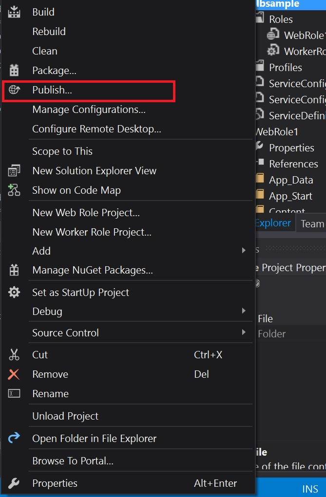
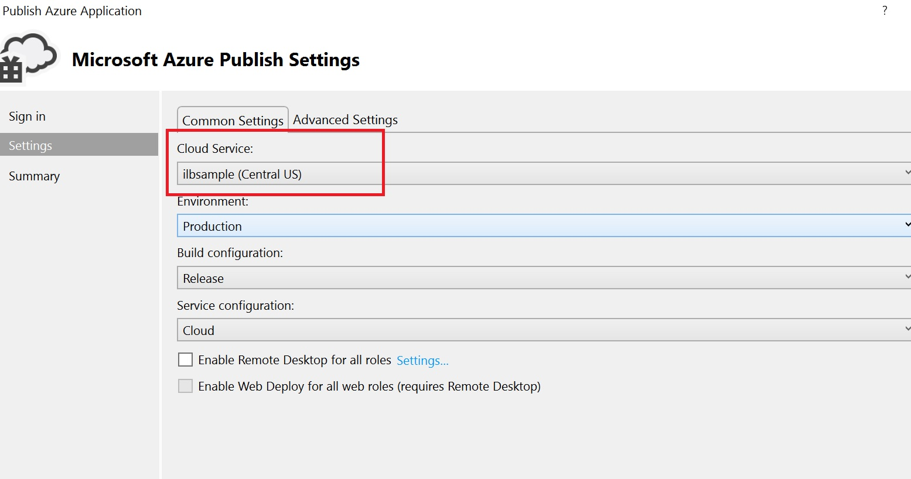
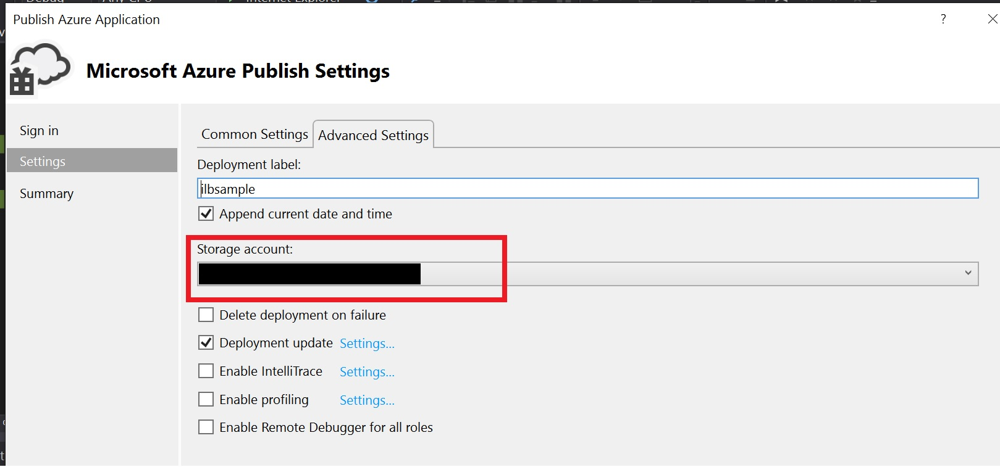
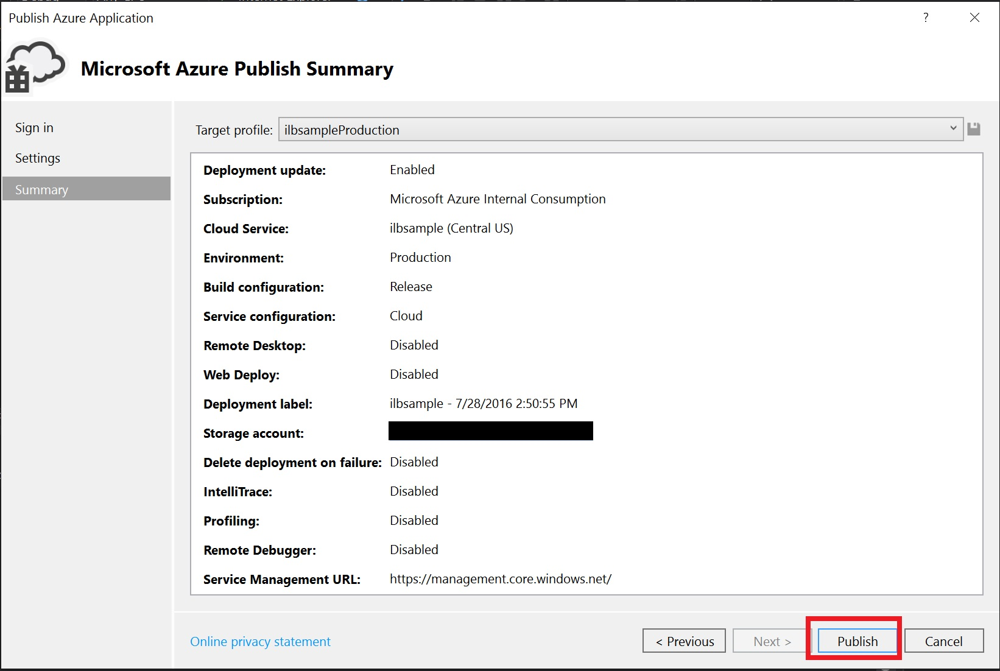

# How to create Internal Load Balancer for PaaS cloud service

## Introduction
Sometimes, we only want to allow cloud service be accessed within a virtual network, or we want to access cloud service by static IP within a virtual network.
This example helps you to configure Internal Load Balancer for web role. This ILB can also be used as worker. In this sample, we will be binding an ILB with port 8080 for web role.
**Note: If you bind a port for ILB, this port will only be accessible by ILB**.  

## Prerequisites
*__Virtual Network__*

Internal Load Balance needs you to deploy a virtual network. Please follow the below wizard to create one.
https://azure.microsoft.com/en-us/documentation/articles/virtual-networks-create-vnet-classic-portal/

## Building the Sample
*__1.	Open Solution in Visual Studio 2015__*

Now you can use Visual Studio 2015 to build a cloud service solution.
This solution contains cloud service project with 1 web role project and 1 work role.

*__2.	Configure Service Definition File__*

Open ServiceDefinition.csdef, add a __Endpoint2__ for load balancer to use.
Change the following settings as yours.

```c#
  <WebRole name="WebRole1" vmsize="Small">
    <Sites>
      <Site name="Web">
        <Bindings>
          <Binding name="Endpoint1" endpointName="Endpoint1" />
          <Binding name="Endpoint2" endpointName="Endpoint2" />
        </Bindings>
      </Site>
    </Sites>
    <ConfigurationSettings>
      <Setting name="Microsoft.WindowsAzure.Plugins.Diagnostics.ConnectionString" />
    </ConfigurationSettings>
    <Endpoints>
      <InputEndpoint name="Endpoint1" protocol="http" port="80" />
      <InputEndpoint name="Endpoint2" protocol="http" port="8080" loadBalancer="name of the load balancer" />
    </Endpoints>
    <Imports>
      <Import moduleName="RemoteAccess" />
    </Imports>
  </WebRole>
```

This cloud service has 2 endpoints. Once we have binded the endpoint2 with ILB, it will no longer be accessible by cloudservice.cloudapp.net:endpoint2. This endpoint2 can then be accessed only by ILB’s IP + port.
If we don’t want cloud service to be accessible from outside the VNet, just remove the endpoint1.

*__3.	Configure Service Configuration File__*

Open ServiceConfiguration.Cloud.cscfg and change content as below.
Change the following settings as yours.

```c#
<NetworkConfiguration>
    <VirtualNetworkSite name="name of virtual network" />
    <AddressAssignments>
      <InstanceAddress roleName="WebRole1">
        <Subnets>
          <Subnet name="Subnet-1" />
        </Subnets>
      </InstanceAddress>
      <InstanceAddress roleName="WorkerRole1">
        <Subnets>
          <Subnet name="Subnet-1" />
        </Subnets>
      </InstanceAddress>
    </AddressAssignments>
    <LoadBalancers>
      <LoadBalancer name="name of the load balancer">
        <FrontendIPConfiguration type="private" subnet="Subnet-1" staticVirtualNetworkIPAddress="static-IP-address" />
      </LoadBalancer>
    </LoadBalancers>
  </NetworkConfiguration>
```

Add the above configuration under last  __&lt;/ Role>__.

## Running the Sample

- Right click cloud service project and choose “Publish…” command.

 

- Choose an existed or create a new Cloud Service in cloud service dropdown list.

 

- Choose an existed or create a new Storage Account in storage account dropdown list.

 

- Then publish this cloud service.

 

## How to verify

We can log on to a VM within that Azure Virtual Network, then try accessing the Cloud Service by ILB's IP  with port 8080 to verify if the internal load balancer works fine or not.
